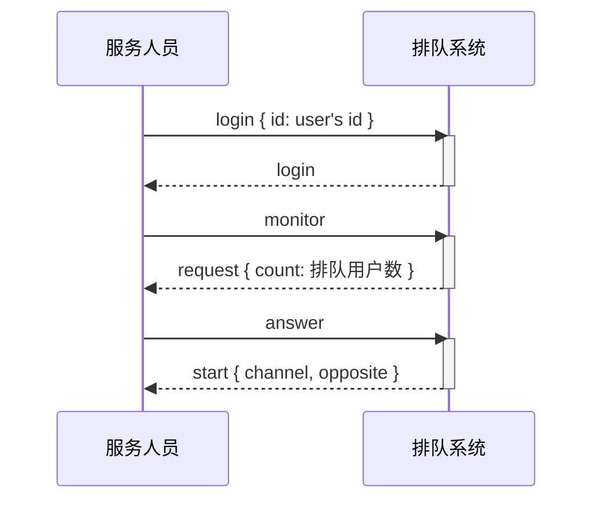
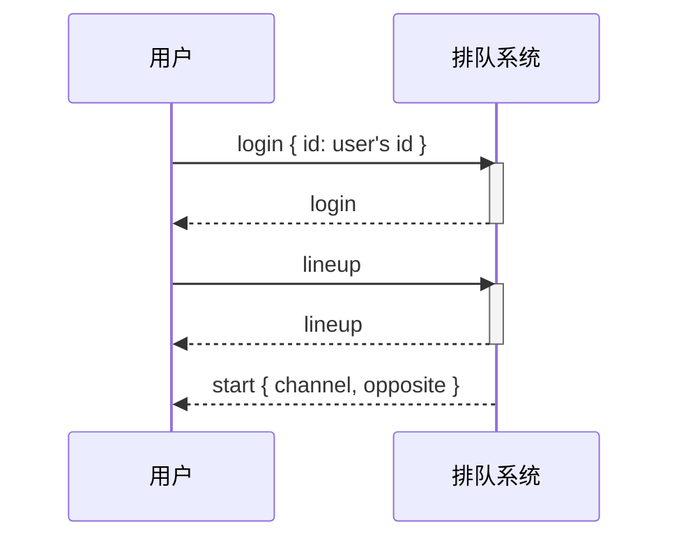

# Alignez

简单的先进先出排队系统，与AgoraCLI项目合用更方便哦！

## 接口说明
本系统使用socket.io进行连接， 默认端口为10010，配置文件为.env。参数都为json格式。如果方法没有写明要求的*调用参数*，则说明没有参数。如果方法没有写明*返回事件*，则说明回返回与方法同名的事件，并且没有返回参数。

### login 用户登录
用户必须登录后才能使用本系统，这里只实现了非常简单的记录功能，具体鉴权部分请要使用的人根据自己的实际要求自行实现。
#### 调用参数
- id: 用户id，声网那边要求在视频通话时的用户uid应为int型
#### 返回事件
- login事件，事件参数为登录时的数据

### logout 用户登出
用户登出后，将退出排队与监听服务

### monitor 监听排队队列
服务人员登录后，调用这个方法，开始监听是否有用户在排队。
#### 返回事件
- monitor事件，表明方法已经被系统处理
- request事件，说明参考*request*事件说明

### lineup 排队
用户在登录系统后，调用这个方法进行排队

### leave 离开
- 服务人员调用这个方法来停止监听服务，调用后将不再收到用户排队要求服务的请求，直到再次调用*monitor*方法。
- 用户调用这个方法来离开排队队列，调用后将不能得到服务人员的服务，直到再次调用*lineup*方法。
#### 返回事件
- 用户调用这个事件后，监听的服务人员会收到*request*事件，其中有当前队列的变动信息，具体请参考*request*事件说明
- 用户与服务人员都会收到*leave*事件来表明方法已被系统处理

### answer 接听
服务人员调用这个方法来接听用户。如果成功接听，则接听的双方都会离开监听与排队队列，直到再次调用*monitor* 与 *lineup* 方法为止。
#### 返回事件
- start事件，如果有用户在排队，则返回被接听的用户与接听的服务人员都会收到*start*事件，具体请参数*start*事件说明
- answer事件，表明方法已被系统处理

## 事件说明

#### request 
本事件只向服务人员发送，表明当前队列的变化情况
##### 事件参数

```json
{
	count: 当前排队人数
}
```

#### start
本事件向接听的服务人员与被接听的用户发送
##### 事件参数 
```json
{
	channel: 双方要进入的频道号,
	opposite: 对方的信息，为登录时的用户信息,
	vendorKey: 系统使用的厂商key,
	channelKey: 声网需要的这个频道的加密密钥，
}
```

## 系统流程

github好像不支持mermaid，各位可以下载后用typora这个markdown编辑器来看。



